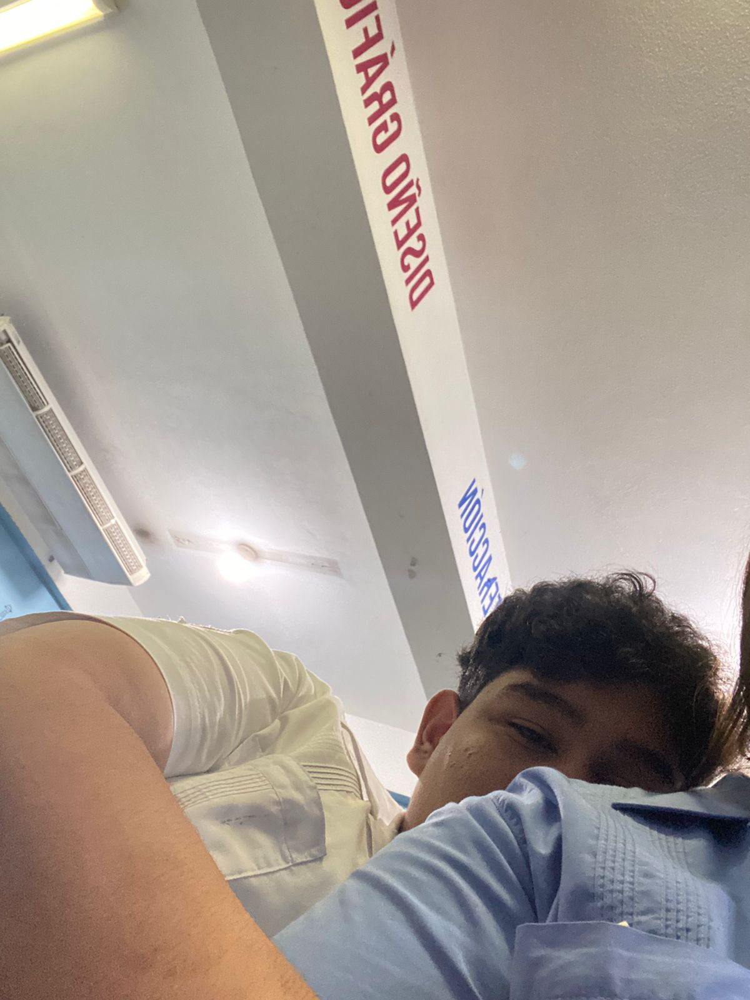
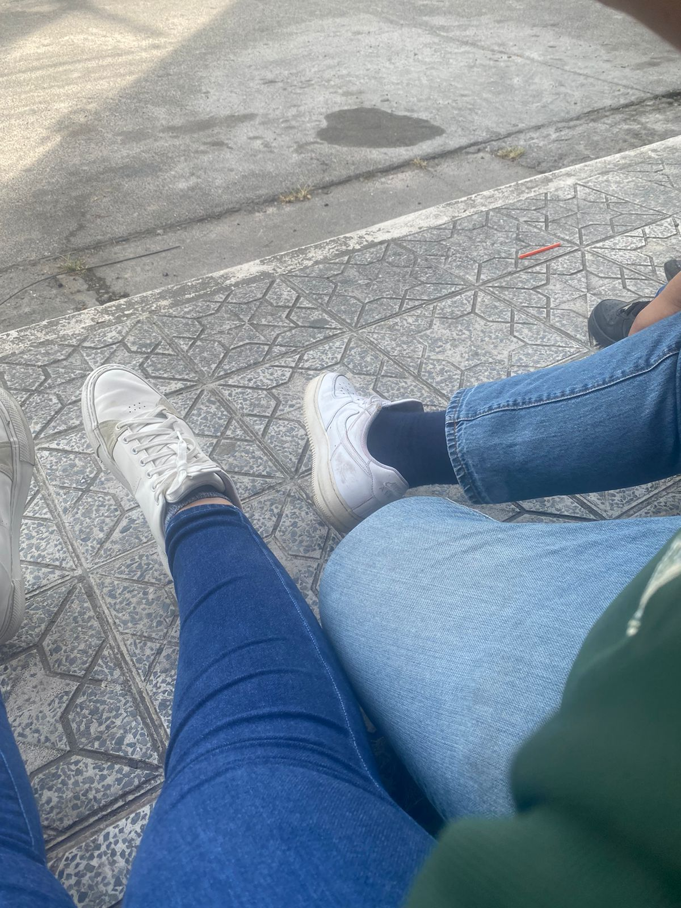
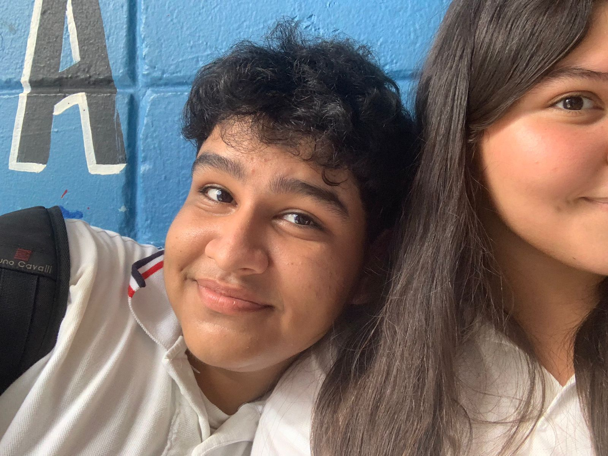
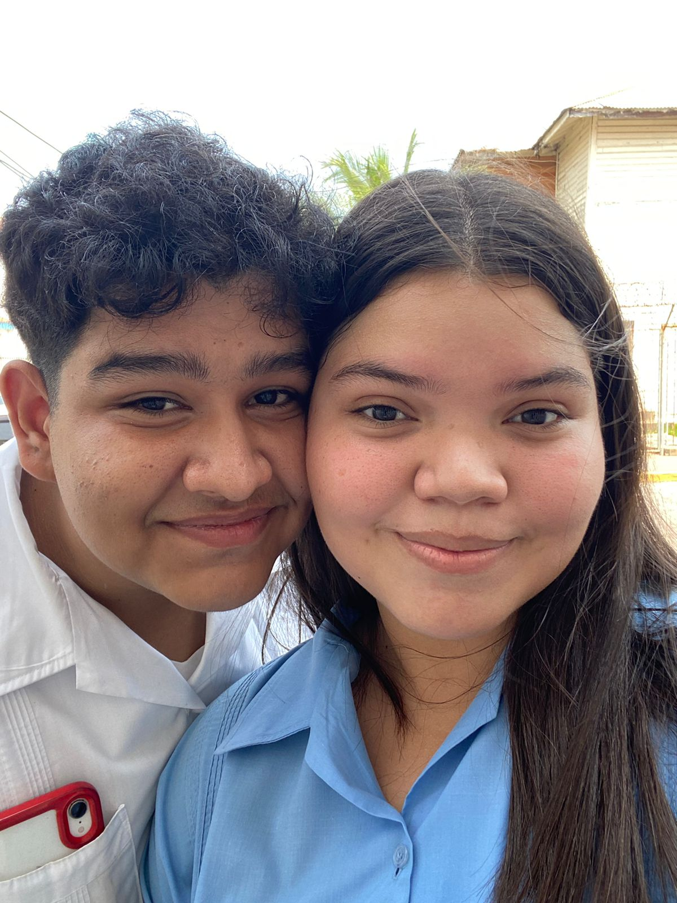
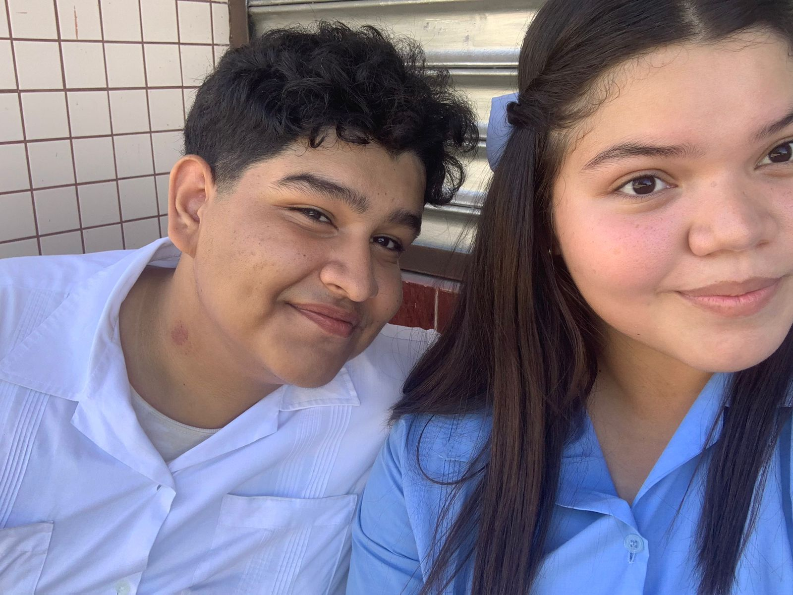

<!DOCTYPE html>
<html lang="es">
<head>
<meta charset="UTF-8">
<meta name="viewport" content="width=device-width, initial-scale=1.0">
<title>10 IMAGENES QUE ME HACEN FELIZ</title>

</head>
<body>

  

    <!-- Primer recuadro -->
    

      

        
      

      

        <h2>1</h2>
        
Eres mi sol en días nublados.

      

    

    <!-- Segundo recuadro -->
  

      

        
      

      

        <h2>2</h2>
        
Cada momento contigo es un tesoro.

      

   

    <!-- Tercer recuadro -->
  

      

        
      

      

        <h2>3</h2>
        
Tu sonrisa ilumina todo a mi alrededor.

      

   

    <!-- Cuarto recuadro -->
  

      

        
      

      

        <h2>4</h2>
        
Contigo, el mundo se vuelve un lugar más hermoso.

      

  

    <!-- Quinto recuadro -->
  

      

        
      

      

        <h2>5</h2>
        
En tus ojos encuentro mi paz.

      

   

    <!-- Sexto recuadro -->
   

      

        
      

      

        <h2>6</h2>
        
Eres mi mejor compañía, mi mejor historia.

      

  

    <!-- Séptimo recuadro -->
  

      

        
      

      

        <h2>7</h2>
        
Contigo, cada día es una aventura que quiero vivir.

      

  

    <!-- Octavo recuadro -->
   

      

        
      

      

        <h2>8</h2>
        
Tu risa es la melodía más bonita que he escuchado.

      

   

    <!-- Noveno recuadro -->
  

      

        
      

      

        <h2>9</h2>
        
Amarte es la mejor decisión que he tomado.

      

  

    <!-- Décimo recuadro -->
   

      

        
      

      

        <h2>10</h2>
        
Eres mi lugar favorito en este mundo.

      

    

  

<button class="prev-button">Anterior</button>
<button class="next-button">Siguiente</button>

</body>
</html>

